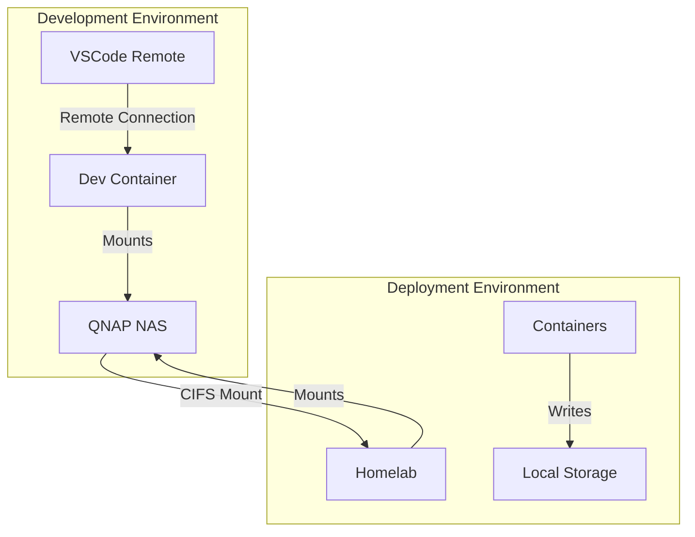
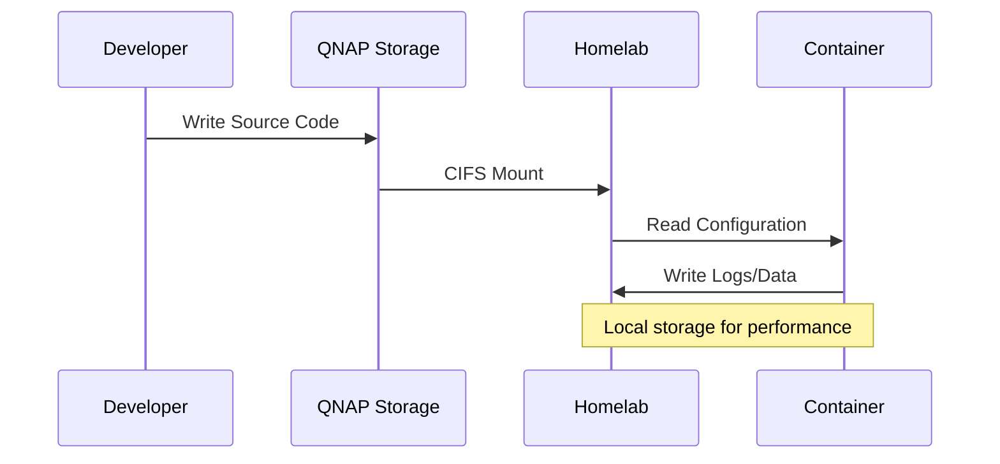

# Development and Deployment Guide: QNAP to Homelab
Version 1.0

## Table of Contents
- [Development and Deployment Guide: QNAP to Homelab](#development-and-deployment-guide-qnap-to-homelab)
  - [Table of Contents](#table-of-contents)
  - [1. Core Architecture](#1-core-architecture)
    - [1.1 Overview](#11-overview)
    - [1.2 System Components](#12-system-components)
    - [1.3 User/Group Strategy](#13-usergroup-strategy)
    - [1.4 Data Flow](#14-data-flow)
  - [2. Directory Structure and Permissions](#2-directory-structure-and-permissions)
    - [2.1 Base Directory Structure](#21-base-directory-structure)
    - [2.2 Permission Model](#22-permission-model)
  - [3. Environment Configuration](#3-environment-configuration)
    - [3.1 CIFS Mount Configuration](#31-cifs-mount-configuration)
    - [3.2 Environment Variables](#32-environment-variables)
    - [3.3 Base Directory Preparation](#33-base-directory-preparation)
  - [4. Implementation Patterns](#4-implementation-patterns)
    - [4.1 Dockerfile Patterns](#41-dockerfile-patterns)
      - [4.1.1 Base User Management](#411-base-user-management)
      - [4.1.2 Development Container](#412-development-container)
      - [4.1.3 Application Container](#413-application-container)
    - [4.2 Docker Compose Patterns](#42-docker-compose-patterns)
      - [4.2.1 Base Configuration](#421-base-configuration)
      - [4.2.2 Development Environment](#422-development-environment)
  - [5. Network and Storage Management](#5-network-and-storage-management)
    - [5.1 Network Configuration](#51-network-configuration)
      - [5.1.1 Network Setup](#511-network-setup)
      - [5.1.2 Network Security](#512-network-security)
    - [5.2 Storage Management](#52-storage-management)
      - [5.2.1 Volume Types](#521-volume-types)
      - [5.2.2 Backup Strategy](#522-backup-strategy)
      - [5.2.3 Log Management](#523-log-management)
  - [6. MagmaBI-Full Implementation](#6-magmabi-full-implementation)
    - [6.1 Project Structure](#61-project-structure)
    - [6.2 Implementation Files](#62-implementation-files)
      - [6.2.1 Development Container](#621-development-container)
      - [6.2.2 Frontend Service](#622-frontend-service)
      - [6.2.3 Backend Service](#623-backend-service)
    - [6.3 Docker Compose Configuration](#63-docker-compose-configuration)
    - [6.4 Setup Process](#64-setup-process)
    - [6.5 Deployment Instructions](#65-deployment-instructions)
  - [7. Public Container Pattern](#7-public-container-pattern)
    - [7.1 Base Structure](#71-base-structure)
    - [7.2 Example: PostgreSQL Implementation](#72-example-postgresql-implementation)
      - [7.2.1 Directory Setup](#721-directory-setup)
      - [7.2.2 Docker Compose Configuration](#722-docker-compose-configuration)
  - [8. Appendices](#8-appendices)
    - [8.1 MagmaBI-Full Quick Start Guide](#81-magmabi-full-quick-start-guide)
      - [8.1.1 Initial Setup Checklist](#811-initial-setup-checklist)
      - [8.1.2 Step-by-Step Implementation](#812-step-by-step-implementation)
    - [8.2 Common Tasks Reference](#82-common-tasks-reference)
      - [8.2.1 Container Management](#821-container-management)
      - [8.2.2 Volume Management](#822-volume-management)
      - [8.2.3 Network Management](#823-network-management)
    - [8.3 Troubleshooting Guide](#83-troubleshooting-guide)
      - [8.3.1 Permission Issues](#831-permission-issues)
      - [8.3.2 Network Issues](#832-network-issues)
      - [8.3.3 Storage Issues](#833-storage-issues)
    - [8.4 Configuration Templates](#84-configuration-templates)
      - [8.4.1 Environment Variables](#841-environment-variables)
      - [8.4.2 Docker Compose Override Template](#842-docker-compose-override-template)
    - [8.5 Maintenance Scripts](#85-maintenance-scripts)
      - [8.5.1 Backup Script](#851-backup-script)
      - [8.5.2 Health Check Script](#852-health-check-script)
    - [8.6 Reference Commands](#86-reference-commands)
  - [9. File Organization and Patterns](#9-file-organization-and-patterns)
    - [9.1 Understanding Docker Compose Base Patterns](#91-understanding-docker-compose-base-patterns)
      - [Basic Pattern Structure](#basic-pattern-structure)
    - [9.2 File Organization](#92-file-organization)
    - [9.3 File References and Usage](#93-file-references-and-usage)
      - [9.3.1 Development Container](#931-development-container)
      - [9.3.2 Development Environment](#932-development-environment)
      - [9.3.3 Production Environment](#933-production-environment)
    - [9.4 Environment Variable Chain](#94-environment-variable-chain)
    - [9.5 Usage Examples](#95-usage-examples)
      - [9.5.1 Development](#951-development)
      - [9.5.2 Homelab Deployment](#952-homelab-deployment)
    - [9.6 Benefits of This Structure](#96-benefits-of-this-structure)
    - [9.7 Implementation Steps](#97-implementation-steps)
  - [10. Image Build and Registry Management](#10-image-build-and-registry-management)
    - [10.1 Build and Deployment Workflow](#101-build-and-deployment-workflow)
    - [10.2 Build Process on QNAP](#102-build-process-on-qnap)
    - [10.3 Deployment on Homelab](#103-deployment-on-homelab)
    - [10.4 Image Management Scripts](#104-image-management-scripts)
    - [10.5 Registry Setup](#105-registry-setup)
      - [10.5.1 Homelab Registry Configuration](#1051-homelab-registry-configuration)
      - [10.5.2 QNAP Registry Configuration](#1052-qnap-registry-configuration)
    - [10.6 Key Guidelines](#106-key-guidelines)
    - [10.7 Registry Maintenance and Cleanup](#107-registry-maintenance-and-cleanup)
      - [10.7.1 Registry Cleanup Script](#1071-registry-cleanup-script)
      - [10.7.2 Registry Configuration for Cleanup](#1072-registry-configuration-for-cleanup)
      - [10.7.3 Automated Cleanup](#1073-automated-cleanup)
      - [10.7.4 Manual Cleanup Commands](#1074-manual-cleanup-commands)
      - [10.7.5 Best Practices for Registry Maintenance](#1075-best-practices-for-registry-maintenance)

## 1. Core Architecture

### 1.1 Overview
This guide describes a development and deployment architecture using QNAP NAS as the development environment and Homelab as the deployment environment. The architecture ensures consistent permissions, reliable data storage, and efficient development workflows.

### 1.2 System Components


### 1.3 User/Group Strategy
```plaintext
Core User/Group Configuration:
- UID: 1000 (consistent across all environments)
- GID: 100 (matches QNAP's 'users' group)

Rationale:
- QNAP uses GID 100 for shared access
- Homelab maintains compatibility via CIFS mount options
- Containers standardize on UID 1000 and GID 100
```

### 1.4 Data Flow


## 2. Directory Structure and Permissions

### 2.1 Base Directory Structure
```plaintext
QNAP (/share/DevelopmentProjects/):
└── ProjectName/
    ├── .devcontainer/          # Dev environment config
    │   ├── devcontainer.json   # VSCode settings
    │   ├── docker-compose.yml  # Container config
    │   └── Dockerfile         # Dev container image
    ├── src/                   # Application source
    ├── config/                # Application config
    │   ├── dev/              # Development environment
    │   └── prod/             # Production environment
    └── docker/               # Container definitions
        ├── dev/
        └── prod/

Homelab:
/docker/
├── compose/                  # Docker compose files
│   └── project-name/
├── logs/                    # Application logs
│   └── project-name/
└── appdata/                 # Persistent data
    └── project-name/
```

### 2.2 Permission Model
```plaintext
Directory Type       Owner:Group    Mode    Purpose
---------------      -----------    ----    -------
Source Code         1000:100       664     Development files
Configuration       1000:100       644     Read-only configs
Log Directory       1000:100       775     Writable logs
Data Directory      1000:100       775     Persistent data
Cache Directory     1000:100       775     Temporary data

Mode Explanation:
775 (rwxrwxr-x): Directory with group write
- User:  rwx (7) Full control
- Group: rwx (7) Full control
- Other: r-x (5) Read & execute

664 (rw-rw-r--): File with group write
- User:  rw- (6) Read & write
- Group: rw- (6) Read & write
- Other: r-- (4) Read only

644 (rw-r--r--): Config file
- User:  rw- (6) Read & write
- Group: r-- (4) Read only
- Other: r-- (4) Read only
```

## 3. Environment Configuration

### 3.1 CIFS Mount Configuration
```bash
# /etc/fstab entry for Homelab
//192.168.2.110/DevelopmentProjects /share/DevelopmentProjects cifs \
    credentials=/home/joe/.smbcredentials,\
    uid=1000,\
    gid=100,\
    file_mode=0664,\
    dir_mode=0775,\
    nobrl,\
    cache=none,\
    actimeo=0,\
    serverino

# Credentials file (/home/joe/.smbcredentials)
username=joe
password=your_password
domain=WORKGROUP
```

### 3.2 Environment Variables
```bash
# .env.common
PROJECT_NAME=project-name
TZ=Asia/Dubai
USERID=1000
GROUPID=100

# .env.dev
ENV=dev
REGISTRY=127.0.0.1:9999
PROJECT_ROOT=/share/DevelopmentProjects/${PROJECT_NAME}
LOG_ROOT=/docker/logs/${PROJECT_NAME}-dev
DATA_ROOT=/docker/appdata/${PROJECT_NAME}-dev

# .env.prod
ENV=prod
REGISTRY=dockerhub.codemian.com
PROJECT_ROOT=/share/DevelopmentProjects/${PROJECT_NAME}
LOG_ROOT=/docker/logs/${PROJECT_NAME}-prod
DATA_ROOT=/docker/appdata/${PROJECT_NAME}-prod
```

### 3.3 Base Directory Preparation
```bash
#!/bin/bash
# prepare-environment.sh

set -e

# Load environment variables
source .env.common
source .env.${ENV}

# Function to create directory with specific permissions
create_dir() {
    local path=$1
    local mode=$2
    local desc=$3
    
    echo "Creating $desc directory: $path"
    sudo mkdir -p "$path"
    sudo chown 1000:100 "$path"
    sudo chmod $mode "$path"
}

# Create required directories
create_dir "${LOG_ROOT}" 775 "logs"
create_dir "${DATA_ROOT}" 775 "data"
create_dir "${PROJECT_ROOT}/config" 755 "configuration"

# Verify CIFS mount
if ! mountpoint -q /share/DevelopmentProjects; then
    echo "ERROR: CIFS mount not found"
    exit 1
fi

echo "Environment preparation complete"
```

## 4. Implementation Patterns

### 4.1 Dockerfile Patterns

#### 4.1.1 Base User Management
```dockerfile
# user-management.sh - Include in all Dockerfiles
RUN echo '#!/bin/sh
# Create/verify group
if ! getent group 100 >/dev/null 2>&1; then
    addgroup -g 100 -S users
fi

# Handle existing UID 1000
if id -u 1000 >/dev/null 2>&1; then
    # User exists - ensure correct group
    usermod -g 100 $(id -un 1000)
else
    # Create new user
    adduser -u 1000 -S appuser -G users
fi' > /usr/local/bin/manage-user && \
    chmod +x /usr/local/bin/manage-user && \
    /usr/local/bin/manage-user
```

#### 4.1.2 Development Container
```dockerfile
# Dockerfile.dev
FROM node:22-alpine

# Copy and execute user management script
COPY user-management.sh /usr/local/bin/
RUN chmod +x /usr/local/bin/user-management.sh && \
    /usr/local/bin/user-management.sh

# Install development tools
RUN apk add --no-cache \
    git \
    curl \
    bash \
    sudo \
    python3 \
    docker-cli

# Configure sudo access
RUN echo "appuser ALL=(ALL) NOPASSWD: ALL" > /etc/sudoers.d/appuser

# Setup workspace
RUN mkdir -p /workspace && \
    chown -R 1000:100 /workspace && \
    chmod -R g+w /workspace

WORKDIR /workspace

USER 1000:100

CMD ["tail", "-f", "/dev/null"]
```

#### 4.1.3 Application Container
```dockerfile
# Dockerfile.app
FROM node:22-alpine

# Copy and execute user management script
COPY user-management.sh /usr/local/bin/
RUN chmod +x /usr/local/bin/user-management.sh && \
    /usr/local/bin/user-management.sh

# Create application directory
RUN mkdir -p /app && \
    chown -R 1000:100 /app && \
    chmod -R g+w /app

WORKDIR /app

# Copy application files with correct ownership
COPY --chown=1000:100 . .

USER 1000:100

CMD ["node", "app.js"]
```

### 4.2 Docker Compose Patterns

#### 4.2.1 Base Configuration
```yaml
# compose-base.yml
x-common-settings: &common-settings
  restart: unless-stopped
  user: "${USERID}:${GROUPID}"
  logging:
    driver: "json-file"
    options:
      max-size: "10m"
      max-file: "3"

x-cifs-volume: &cifs-volume
  bind:
    mount-options:
      - uid=${USERID}
      - gid=${GROUPID}
      - file_mode=0664
      - dir_mode=0775
      - nobrl
      - cache=none
      - actimeo=0

x-local-volume: &local-volume
  bind:
    mount-options:
      - uid=${USERID}
      - gid=${GROUPID}

services:
  base:
    &base-service
    <<: *common-settings
    networks:
      - project-network
    dns:
      - 192.168.2.1
```

#### 4.2.2 Development Environment
```yaml
# docker-compose.dev.yml
services:
  app:
    <<: *base-service
    build:
      context: .
      dockerfile: Dockerfile.dev
    volumes:
      # Source code (CIFS)
      - type: bind
        source: ${PROJECT_ROOT}/src
        target: /app
        <<: *cifs-volume
      
      # Logs (local)
      - type: bind
        source: ${LOG_ROOT}
        target: /app/logs
        <<: *local-volume
      
      # Configuration
      - type: bind
        source: ${PROJECT_ROOT}/config/dev
        target: /app/config
        read_only: true
```

## 5. Network and Storage Management

### 5.1 Network Configuration

#### 5.1.1 Network Setup
```bash
#!/bin/bash
# setup-networks.sh

declare -A NETWORKS=(
    ["project-network"]="Project internal communication"
    ["traefik-proxy"]="Reverse proxy network"
    ["redis-network"]="Redis communication"
)

for network in "${!NETWORKS[@]}"; do
    if ! docker network inspect "$network" >/dev/null 2>&1; then
        echo "Creating network: $network (${NETWORKS[$network]})"
        docker network create "$network"
    fi
done
```

#### 5.1.2 Network Security
```yaml
# Network isolation example
services:
  frontend:
    networks:
      - traefik-proxy
      - project-network
    
  backend:
    networks:
      - project-network
      - redis-network
    
  redis:
    networks:
      - redis-network

networks:
  traefik-proxy:
    external: true
  project-network:
    internal: true
  redis-network:
    internal: true
```

### 5.2 Storage Management

#### 5.2.1 Volume Types
```yaml
x-volume-types:
  # Configuration volumes (read-only)
  config: &config-volume
    type: bind
    read_only: true
    bind:
      mount-options:
        - uid=${USERID}
        - gid=${GROUPID}
        - file_mode=0644
        - dir_mode=0755

  # Data volumes (read-write)
  data: &data-volume
    type: bind
    bind:
      mount-options:
        - uid=${USERID}
        - gid=${GROUPID}
        - file_mode=0664
        - dir_mode=0775

  # Development volumes (CIFS)
  dev: &dev-volume
    type: bind
    bind:
      mount-options:
        - uid=${USERID}
        - gid=${GROUPID}
        - file_mode=0664
        - dir_mode=0775
        - nobrl
        - cache=none
        - actimeo=0
```

#### 5.2.2 Backup Strategy
```bash
#!/bin/bash
# backup-volumes.sh

backup_root="/share/DevelopmentProjects/Backups"
timestamp=$(date +%Y%m%d_%H%M%S)

# Function to backup a volume
backup_volume() {
    local src=$1
    local name=$2
    
    echo "Backing up $name..."
    tar czf "$backup_root/${name}_${timestamp}.tar.gz" -C "$(dirname $src)" "$(basename $src)"
}

# Backup application data
backup_volume "${DATA_ROOT}" "appdata"

# Backup configurations
backup_volume "${PROJECT_ROOT}/config" "config"

# Rotate old backups (keep last 7 days)
find "$backup_root" -name "*.tar.gz" -mtime +7 -delete
```

#### 5.2.3 Log Management
```bash
# /etc/logrotate.d/docker-containers
/docker/logs/*/*.log {
    daily
    rotate 7
    compress
    delaycompress
    missingok
    copytruncate
    create 0664 1000 100
}
```
## 6. MagmaBI-Full Implementation

### 6.1 Project Structure
```plaintext
MagmaBI-Full/
├── .devcontainer/                # Development container configuration
│   ├── devcontainer.json        # VSCode settings
│   ├── docker-compose.yml       # Dev container definition
│   └── Dockerfile              # Dev environment image
├── backend/                     # Python FastAPI backend
├── magmabi/                    # Next.js frontend
├── docker/
│   ├── dev/
│   │   ├── frontend/
│   │   │   └── Dockerfile
│   │   ├── backend/
│   │   │   └── Dockerfile
│   │   └── docker-compose.yml
│   └── prod/
│       ├── frontend/
│       │   └── Dockerfile
│       ├── backend/
│       │   └── Dockerfile
│       └── docker-compose.yml
└── config/
    ├── dev/
    │   └── redis.conf
    └── prod/
        └── redis.conf
```

### 6.2 Implementation Files

#### 6.2.1 Development Container
```dockerfile
# .devcontainer/Dockerfile
FROM node:22-alpine

RUN apk add --no-cache \
    git \
    curl \
    bash \
    sudo \
    python3 \
    py3-pip \
    docker-cli \
    build-base \
    openssl

# User management
RUN addgroup -g 100 -S users && \
    adduser -u 1000 -S joe -G users && \
    echo "joe ALL=(ALL) NOPASSWD: ALL" > /etc/sudoers.d/joe

# Development tools
RUN npm install -g pnpm && \
    pip3 install poetry

WORKDIR /workspace

USER 1000:100
```

```yaml
# .devcontainer/docker-compose.yml
services:
  ide:
    build: 
      context: .
      dockerfile: Dockerfile
    volumes:
      - ${PROJECT_ROOT}:/workspace
      - ${PROJECT_ROOT}/..:/share/DevelopmentProjects
      - /var/run/docker.sock:/var/run/docker.sock
    networks:
      - devcontainers_network
      - traefik-proxy
    environment:
      - DOCKER_HOST=unix:///var/run/docker.sock
```

#### 6.2.2 Frontend Service
```dockerfile
# docker/dev/frontend/Dockerfile
FROM node:22-alpine

# User setup
COPY user-management.sh /usr/local/bin/
RUN chmod +x /usr/local/bin/user-management.sh && \
    /usr/local/bin/user-management.sh

# Install pnpm
RUN npm install -g pnpm

WORKDIR /app

USER 1000:100

CMD ["pnpm", "run", "dev"]
```

#### 6.2.3 Backend Service
```dockerfile
# docker/dev/backend/Dockerfile
FROM python:3.12-alpine

# User setup
COPY user-management.sh /usr/local/bin/
RUN chmod +x /usr/local/bin/user-management.sh && \
    /usr/local/bin/user-management.sh

# Install dependencies
RUN apk add --no-cache \
    build-base \
    libffi-dev \
    openssl-dev

WORKDIR /app

USER 1000:100

CMD ["uvicorn", "api.asgi:api", "--host", "0.0.0.0", "--port", "8000", "--reload"]
```

### 6.3 Docker Compose Configuration

```yaml
# docker/dev/docker-compose.yml
services:
  frontend:
    build:
      context: ./frontend
    image: ${REGISTRY}/magmabi-full_frontend-dev:latest
    volumes:
      - ${PROJECT_ROOT}/magmabi:/app
      - ${LOG_ROOT}:/workspace/logs/dev
    environment:
      - NODE_ENV=development
    labels:
      - traefik.enable=true
      - traefik.http.routers.magmabi-dev.rule=Host(`dev-magmabi.codemian.com`)

  backend:
    build:
      context: ./backend
    image: ${REGISTRY}/magmabi-full_backend-dev:latest
    volumes:
      - ${PROJECT_ROOT}/backend:/app
      - ${LOG_ROOT}:/workspace/logs/dev
      - ${DATA_ROOT}/cache:/data_provider_caches
    environment:
      - PYTHONPATH=/app
    labels:
      - traefik.enable=true
      - traefik.http.routers.magmabi-backend-dev.rule=Host(`dev-api-magmabi.codemian.com`)

  redis:
    image: redis:latest
    user: "1000:100"
    volumes:
      - ${DATA_ROOT}/redis:/data
      - ${PROJECT_ROOT}/config/dev/redis.conf:/usr/local/etc/redis/redis.conf:ro

  celery_worker:
    image: ${REGISTRY}/magmabi-full_backend-dev:latest
    command: celery -A data_providers.celery_task_manager.celery_app.app worker -Q lightspeed_queue -n worker@%h --loglevel=debug
    volumes:
      - ${PROJECT_ROOT}/backend:/app
      - ${LOG_ROOT}:/workspace/logs/dev
      - ${DATA_ROOT}/cache:/data_provider_caches
    depends_on:
      - redis
```

### 6.4 Setup Process

```bash
#!/bin/bash
# setup-magmabi.sh

# Load environment
source .env

# Required directories
declare -A DIRS=(
    [logs]="${LOG_ROOT}"
    [redis_data]="${DATA_ROOT}/redis"
    [cache]="${DATA_ROOT}/cache"
    [config]="${PROJECT_ROOT}/config"
)

# Create directories
for dir in "${!DIRS[@]}"; do
    path="${DIRS[$dir]}"
    echo "Creating $dir directory: $path"
    sudo mkdir -p "$path"
    sudo chown 1000:100 "$path"
    sudo chmod 775 "$path"
done

# Create networks
networks=(
    "magmabi-fullstack-network-dev"
    "redis_admin_network"
    "traefik-proxy"
)

for network in "${networks[@]}"; do
    docker network create "$network" || true
done
```

### 6.5 Deployment Instructions

1. Initial Setup:
```bash
# Clone repository
git clone <repository-url> /share/DevelopmentProjects/MagmaBI-Full

# Prepare environment
cd /docker/compose/magmabi-full
./setup-magmabi.sh

# Start development environment
docker compose up -d
```

2. Development Workflow:
```bash
# Open in VSCode
code /share/DevelopmentProjects/MagmaBI-Full

# Start development container
F1 -> Remote-Containers: Open Folder in Container

# Run development services
docker compose -f docker/dev/docker-compose.yml up -d
```

3. Production Deployment:
```bash
# Build images
docker compose -f docker/prod/docker-compose.yml build

# Push images
docker compose -f docker/prod/docker-compose.yml push

# Deploy
docker compose -f docker/prod/docker-compose.yml up -d
```

## 7. Public Container Pattern

### 7.1 Base Structure
```plaintext
/share/DevelopmentProjects/
└── Containers/
    └── ServiceName/
        ├── config/
        │   ├── dev/
        │   └── prod/
        └── docker/
            ├── dev/
            └── prod/

/docker/
├── compose/
│   └── service-name/
├── logs/
│   └── service-name/
└── appdata/
    └── service-name/
```

### 7.2 Example: PostgreSQL Implementation

#### 7.2.1 Directory Setup
```bash
#!/bin/bash
# setup-postgres.sh

SERVICE="postgres"
ENV=${1:-dev}

# Create directories
mkdir -p /share/DevelopmentProjects/Containers/${SERVICE}/config/${ENV}
mkdir -p /docker/compose/${SERVICE}-${ENV}
mkdir -p /docker/logs/${SERVICE}-${ENV}
mkdir -p /docker/appdata/${SERVICE}-${ENV}

# Set permissions
chown -R 1000:100 /docker/{logs,appdata}/${SERVICE}-${ENV}
chmod -R 775 /docker/{logs,appdata}/${SERVICE}-${ENV}
```

#### 7.2.2 Docker Compose Configuration
```yaml
# docker-compose.yml
services:
  postgres:
    image: postgres:15
    user: "1000:100"
    environment:
      POSTGRES_USER: ${POSTGRES_USER}
      POSTGRES_PASSWORD: ${POSTGRES_PASSWORD}
      PGDATA: /var/lib/postgresql/data
    volumes:
      # Configuration from QNAP
      - type: bind
        source: /share/DevelopmentProjects/Containers/postgres/config/${ENV}
        target: /etc/postgresql
        read_only: true
        bind:
          mount-options:
            - uid=1000
            - gid=100
            - file_mode=0644
            - dir_mode=0755
      
      # Data on Homelab
      - type: bind
        source: /docker/appdata/postgres-${ENV}/data
        target: /var/lib/postgresql/data
        bind:
          mount-options:
            - uid=1000
            - gid=100
            - file_mode=0600
            - dir_mode=0700
      
      # Logs on Homelab
      - type: bind
        source: /docker/logs/postgres-${ENV}
        target: /var/log/postgresql
        bind:
          mount-options:
            - uid=1000
            - gid=100
            - file_mode=0644
            - dir_mode=0755
```

## 8. Appendices

### 8.1 MagmaBI-Full Quick Start Guide

#### 8.1.1 Initial Setup Checklist
```bash
# 1. Homelab Prerequisites
[ ] CIFS mount configured
[ ] Docker installed
[ ] Docker Compose installed
[ ] Networks created
[ ] Base directories created

# 2. Required Configuration Files
[ ] .env.development
[ ] .env.production
[ ] Redis configuration
[ ] Traefik labels

# 3. Directory Structure
[ ] /share/DevelopmentProjects/MagmaBI-Full clone
[ ] /docker/logs/magmabi-full-dev
[ ] /docker/appdata/magmabi-full-dev
```

#### 8.1.2 Step-by-Step Implementation
```bash
# 1. Clone Repository
git clone <repository-url> /share/DevelopmentProjects/MagmaBI-Full

# 2. Create Environment File
cat > /docker/compose/magmabi-full-dev/.env << 'EOF'
PROJECT_NAME=magmabi-full
ENV=dev
REGISTRY=127.0.0.1:9999
PROJECT_ROOT=/share/DevelopmentProjects/MagmaBI-Full
LOG_ROOT=/docker/logs/magmabi-full-dev
DATA_ROOT=/docker/appdata/magmabi-full-dev
USERID=1000
GROUPID=100
EOF

# 3. Create Directory Structure
mkdir -p /docker/{logs,appdata}/magmabi-full-dev/{redis,cache}
chown -R 1000:100 /docker/{logs,appdata}/magmabi-full-dev
chmod -R 775 /docker/{logs,appdata}/magmabi-full-dev

# 4. Create Networks
docker network create magmabi-fullstack-network-dev
docker network create redis_admin_network
docker network create traefik-proxy

# 5. Start Services
cd /docker/compose/magmabi-full-dev
docker compose up -d
```

### 8.2 Common Tasks Reference

#### 8.2.1 Container Management
```bash
# View container logs
docker compose logs -f [service]

# Restart service
docker compose restart [service]

# Update single service
docker compose up -d --build [service]

# Check container permissions
docker exec [container] sh -c 'ls -la /app'
```

#### 8.2.2 Volume Management
```bash
# Check volume permissions
ls -la /docker/logs/magmabi-full-dev
ls -la /docker/appdata/magmabi-full-dev

# Fix permissions
sudo chown -R 1000:100 /docker/logs/magmabi-full-dev
sudo chmod -R 775 /docker/logs/magmabi-full-dev

# Backup volumes
tar czf backup.tar.gz -C /docker/appdata/magmabi-full-dev .
```

#### 8.2.3 Network Management
```bash
# List networks
docker network ls

# Inspect network
docker network inspect magmabi-fullstack-network-dev

# Connect container to network
docker network connect magmabi-fullstack-network-dev [container]
```

### 8.3 Troubleshooting Guide

#### 8.3.1 Permission Issues
```bash
# Problem: Container can't write to volume
# Solution:

# 1. Check container user
docker exec [container] id

# 2. Verify volume permissions
ls -la /docker/logs/magmabi-full-dev

# 3. Fix permissions
sudo chown -R 1000:100 /docker/logs/magmabi-full-dev
sudo chmod -R 775 /docker/logs/magmabi-full-dev

# 4. Verify CIFS mount
mount | grep DevelopmentProjects
```

#### 8.3.2 Network Issues
```bash
# Problem: Container can't connect to network
# Solution:

# 1. Check network existence
docker network ls | grep magmabi

# 2. Verify network configuration
docker network inspect magmabi-fullstack-network-dev

# 3. Recreate network if needed
docker network rm magmabi-fullstack-network-dev
docker network create magmabi-fullstack-network-dev
```

#### 8.3.3 Storage Issues
```bash
# Problem: Volume mount fails
# Solution:

# 1. Check directory existence
ls -la /docker/appdata/magmabi-full-dev

# 2. Verify mount options
docker inspect [container] | grep Mounts -A 20

# 3. Check CIFS connectivity
df -h | grep DevelopmentProjects
```

### 8.4 Configuration Templates

#### 8.4.1 Environment Variables
```bash
# .env.template
# Common settings
PROJECT_NAME=magmabi-full
TZ=Asia/Dubai
USERID=1000
GROUPID=100

# Registry settings
REGISTRY=127.0.0.1:9999
REGISTRY_USERNAME=
REGISTRY_PASSWORD=

# Paths
PROJECT_ROOT=/share/DevelopmentProjects/MagmaBI-Full
LOG_ROOT=/docker/logs/magmabi-full-dev
DATA_ROOT=/docker/appdata/magmabi-full-dev

# Application settings
NODE_ENV=development
PYTHONPATH=/app
```

#### 8.4.2 Docker Compose Override Template
```yaml
# docker-compose.override.yml
services:
  frontend:
    build:
      context: ./frontend
      args:
        NODE_ENV: development
    volumes:
      - ${PROJECT_ROOT}/magmabi:/app
    environment:
      - DEBUG=true

  backend:
    build:
      context: ./backend
      args:
        ENV: development
    volumes:
      - ${PROJECT_ROOT}/backend:/app
    environment:
      - DEBUG=true
```

### 8.5 Maintenance Scripts

#### 8.5.1 Backup Script
```bash
#!/bin/bash
# backup-magmabi.sh

timestamp=$(date +%Y%m%d_%H%M%S)
backup_root="/share/DevelopmentProjects/Backups/magmabi"

# Ensure backup directory exists
mkdir -p "$backup_root"

# Backup function
backup_directory() {
    local src=$1
    local name=$2
    tar czf "$backup_root/${name}_${timestamp}.tar.gz" -C "$(dirname $src)" "$(basename $src)"
}

# Backup data
backup_directory "/docker/appdata/magmabi-full-dev" "appdata"
backup_directory "/docker/logs/magmabi-full-dev" "logs"
backup_directory "${PROJECT_ROOT}/config" "config"

# Cleanup old backups (keep last 7 days)
find "$backup_root" -name "*.tar.gz" -mtime +7 -delete
```

#### 8.5.2 Health Check Script
```bash
#!/bin/bash
# health-check.sh

# Check container status
check_container() {
    local container=$1
    if [ "$(docker inspect -f '{{.State.Running}}' $container 2>/dev/null)" != "true" ]; then
        echo "ERROR: Container $container is not running"
        return 1
    fi
}

# Check service health
for service in frontend backend redis celery_worker; do
    container="magmabi-full_${service}-dev"
    check_container $container
done

# Check volume permissions
check_permissions() {
    local path=$1
    if [ ! -w "$path" ]; then
        echo "ERROR: Directory $path is not writable"
        return 1
    fi
}

check_permissions "/docker/logs/magmabi-full-dev"
check_permissions "/docker/appdata/magmabi-full-dev"
```

### 8.6 Reference Commands

```bash
# Common operations quick reference

# Start development environment
cd /docker/compose/magmabi-full-dev
docker compose up -d

# View logs
docker compose logs -f [service]

# Rebuild service
docker compose up -d --build [service]

# Reset permissions
sudo chown -R 1000:100 /docker/{logs,appdata}/magmabi-full-dev
sudo chmod -R 775 /docker/{logs,appdata}/magmabi-full-dev

# Create new network
docker network create [network-name]

# Backup data
./backup-magmabi.sh

# Health check
./health-check.sh
```
## 9. File Organization and Patterns

### 9.1 Understanding Docker Compose Base Patterns

Docker Compose base patterns provide reusable configurations through YAML anchors and aliases. These patterns help maintain consistency across different environments and reduce configuration duplication.

#### Basic Pattern Structure
```yaml
# /share/DevelopmentProjects/MagmaBI-Full/docker/base/compose-base.yml

# Define common settings that will be reused
x-common-settings: &common-settings  # '&' creates an anchor
  restart: unless-stopped
  user: "${USERID}:${GROUPID}"
  logging:
    driver: "json-file"
    options:
      max-size: "10m"
      max-file: "3"

# Define volume patterns
x-volume-patterns: &volume-patterns
  bind:
    mount-options:
      - uid=${USERID}
      - gid=${GROUPID}
      - file_mode=0664
      - dir_mode=0775

# Example usage in services
services:
  base-service: &base-service
    <<: *common-settings    # '*' references the anchor
    networks:
      - project-network
    dns:
      - 192.168.2.1
```

### 9.2 File Organization

```plaintext
Repository Structure (/share/DevelopmentProjects/MagmaBI-Full/):
├── .devcontainer/                    # Development container config
│   ├── devcontainer.json            # VSCode settings
│   ├── docker-compose.yml           # Dev container compose
│   └── Dockerfile                   # Dev container image
│
├── docker/                          # Docker configurations
│   ├── base/                        # Shared/base configurations
│   │   ├── compose-base.yml         # Common settings (version controlled)
│   │   └── user-management.sh       # User setup script
│   │
│   ├── dev/                         # Development environment
│   │   ├── .env.development         # Dev environment variables
│   │   └── docker-compose.yml       # Dev services
│   │
│   └── prod/                        # Production environment
│       ├── .env.production          # Production variables
│       └── docker-compose.yml       # Production services
│
└── config/                          # Application configurations
    ├── dev/                         # Development configs
    └── prod/                        # Production configs

Homelab Structure (/docker/):
├── compose/
│   └── magmabi-full/               # Local deployment configs
│       ├── .env                    # Local settings
│       └── docker-compose.yml      # Local compose file
├── logs/
│   └── magmabi-full/              # Application logs
└── appdata/
    └── magmabi-full/              # Persistent data
```

### 9.3 File References and Usage

#### 9.3.1 Development Container
```yaml
# .devcontainer/docker-compose.yml
services:
  ide:
    build:
      context: .
      dockerfile: Dockerfile
    volumes:
      - ..:/workspace                # Project root
      - ../../:/share/DevelopmentProjects  # Parent directory
```

#### 9.3.2 Development Environment
```yaml
# docker/dev/docker-compose.yml
include:
  - path: ../base/compose-base.yml   # Include base settings

services:
  frontend:
    <<: *common-settings            # Use common settings
    build:
      context: ../../frontend       # Reference frontend code
    volumes:
      - ../../frontend:/app         # Mount source
      - ${LOG_ROOT}:/app/logs       # Mount logs
```

#### 9.3.3 Production Environment
```yaml
# /docker/compose/magmabi-full/docker-compose.yml
include:
  - path: /share/DevelopmentProjects/MagmaBI-Full/docker/base/compose-base.yml

services:
  frontend:
    <<: *common-settings
    image: ${REGISTRY}/frontend:${TAG}
    volumes:
      - /share/DevelopmentProjects/MagmaBI-Full/frontend:/app:ro
      - /docker/logs/magmabi-full:/app/logs
```

### 9.4 Environment Variable Chain

```bash
# 1. Base variables (/share/DevelopmentProjects/MagmaBI-Full/docker/base/.env)
USERID=1000
GROUPID=100
PROJECT_NAME=magmabi-full

# 2. Environment-specific variables (docker/dev/.env.development)
ENV=development
REGISTRY=127.0.0.1:9999
LOG_ROOT=/docker/logs/${PROJECT_NAME}-dev

# 3. Local deployment variables (/docker/compose/magmabi-full/.env)
LOG_ROOT=/docker/logs/magmabi-full
DATA_ROOT=/docker/appdata/magmabi-full
```

### 9.5 Usage Examples

#### 9.5.1 Development
```bash
# Start development environment
cd /share/DevelopmentProjects/MagmaBI-Full/docker/dev
docker compose --env-file .env.development up -d
```

#### 9.5.2 Homelab Deployment
```bash
# Deploy to homelab
cd /docker/compose/magmabi-full
docker compose up -d
```

### 9.6 Benefits of This Structure

1. **DRY (Don't Repeat Yourself)**:
   - Common settings defined once
   - Reused across environments
   - Reduces configuration errors

2. **Clear Separation**:
   - Source code in repository
   - Configuration in version control
   - Local data and logs on deployment host
   - Environment-specific settings separated

3. **Maintainability**:
   - Base patterns easily updated
   - Environment differences clearly visible
   - Consistent structure across projects

4. **Flexibility**:
   - Easy to add new services
   - Environment-specific overrides
   - Clear upgrade path

### 9.7 Implementation Steps

1. **Set Up Repository Structure**:
```bash
# Create base structure
mkdir -p /share/DevelopmentProjects/MagmaBI-Full/docker/{base,dev,prod}

# Copy base configurations
cp compose-base.yml /share/DevelopmentProjects/MagmaBI-Full/docker/base/
```

2. **Prepare Homelab Structure**:
```bash
# Create deployment structure
mkdir -p /docker/{compose,logs,appdata}/magmabi-full

# Set permissions
chown -R 1000:100 /docker/{logs,appdata}/magmabi-full
chmod -R 775 /docker/{logs,appdata}/magmabi-full
```

3. **Configure Environment Variables**:
```bash
# Copy and modify environment files
cp docker/base/.env.example docker/dev/.env.development
cp docker/base/.env.example docker/prod/.env.production
```

This structure ensures:
- Base patterns are version controlled
- Local configurations are separated
- Deployments are consistent
- Maintenance is simplified

## 10. Image Build and Registry Management

### 10.1 Build and Deployment Workflow

All images are built on the QNAP development host and pushed to the Homelab registry. The Homelab deployment pulls images from its local registry.


### 10.2 Build Process on QNAP

```bash
# Set registry variables
REGISTRY="192.168.2.111:9999"  # Homelab registry
PROJECT="magmabi-full"

# Navigate to project directory
cd /share/DevelopmentProjects/MagmaBI-Full

# Build frontend
docker build \
    -t ${REGISTRY}/${PROJECT}_frontend-dev:latest \
    -f docker/dev/frontend/Dockerfile \
    ./magmabi

# Build backend
docker build \
    -t ${REGISTRY}/${PROJECT}_backend-dev:latest \
    -f docker/dev/backend/Dockerfile \
    ./backend

# Push to homelab registry
docker push ${REGISTRY}/${PROJECT}_frontend-dev:latest
docker push ${REGISTRY}/${PROJECT}_backend-dev:latest
```

### 10.3 Deployment on Homelab

```yaml
# /docker/compose/magmabi-full/docker-compose.yml
services:
  frontend:
    image: 127.0.0.1:9999/magmabi-full_frontend-dev:latest
    # ... rest of config

  backend:
    image: 127.0.0.1:9999/magmabi-full_backend-dev:latest
    # ... rest of config
```

```bash
# Deploy on Homelab
cd /docker/compose/magmabi-full
docker compose pull   # Explicitly pull new images
docker compose up -d  # Deploy services
```

### 10.4 Image Management Scripts

```bash
#!/bin/bash
# /share/DevelopmentProjects/MagmaBI-Full/scripts/build-push-images.sh
# Run on QNAP

REGISTRY="192.168.2.111:9999"
PROJECT="magmabi-full"
ENVIRONMENTS=("dev" "prod")

build_push_image() {
    local service=$1
    local env=$2
    local dockerfile="docker/${env}/${service}/Dockerfile"
    local tag="${REGISTRY}/${PROJECT}_${service}-${env}:latest"
    
    echo "Building ${service} for ${env}..."
    docker build \
        -t ${tag} \
        -f ${dockerfile} \
        ./${service}
    
    echo "Pushing ${tag}..."
    docker push ${tag}
}

for env in "${ENVIRONMENTS[@]}"; do
    build_push_image "frontend" ${env}
    build_push_image "backend" ${env}
done
```

### 10.5 Registry Setup

#### 10.5.1 Homelab Registry Configuration

```bash
# 1. Create registry directories
sudo mkdir -p /docker/appdata/registry
sudo chown -R 1000:100 /docker/appdata/registry

# 2. Run registry container
docker run -d \
    --name registry \
    --restart always \
    -p 9999:5000 \
    -v /docker/appdata/registry:/var/lib/registry \
    registry:2

# 3. Configure insecure registry
# Add to /etc/docker/daemon.json:
{
    "insecure-registries": ["127.0.0.1:9999"]
}

# 4. Restart Docker daemon
sudo systemctl restart docker
```

#### 10.5.2 QNAP Registry Configuration

```bash
# 1. Configure insecure registry
# Add to /etc/docker/daemon.json:
{
    "insecure-registries": ["192.168.2.111:9999"]
}

# 2. Restart Docker daemon
sudo systemctl restart docker
```

### 10.6 Key Guidelines

1. **Build Process**:
   - Always build images on QNAP development host
   - Never build images on Homelab deployment host
   - Use consistent tagging scheme

2. **Registry Usage**:
   - Push from QNAP to Homelab registry
   - Pull from local registry on Homelab (127.0.0.1:9999)
   - Use explicit pull commands before deployment

3. **Version Control**:
   - Keep all Dockerfiles in repository
   - Maintain build scripts in repository
   - Document registry references

4. **Security Considerations**:
   - Use internal network for registry communication
   - Implement proper access controls
   - Regular cleanup of old images

### 10.7 Registry Maintenance and Cleanup

#### 10.7.1 Registry Cleanup Script
```bash
#!/bin/bash
# /docker/compose/registry/cleanup-registry.sh

# Configuration
REGISTRY_HOST="localhost:9999"
REGISTRY_DIR="/docker/appdata/registry"
DAYS_TO_KEEP=30

# Function to delete an image tag
delete_tag() {
    local image=$1
    local tag=$2
    local digest=$(curl -s -H "Accept: application/vnd.docker.distribution.manifest.v2+json" \
        "http://${REGISTRY_HOST}/v2/${image}/manifests/${tag}" | jq -r .config.digest)
    
    if [ ! -z "$digest" ]; then
        echo "Deleting ${image}:${tag}"
        curl -s -X DELETE "http://${REGISTRY_HOST}/v2/${image}/manifests/${digest}"
    fi
}

# Get list of repositories
repositories=$(curl -s "http://${REGISTRY_HOST}/v2/_catalog" | jq -r '.repositories[]')

for repo in $repositories; do
    # Get tags for repository
    tags=$(curl -s "http://${REGISTRY_HOST}/v2/${repo}/tags/list" | jq -r '.tags[]')
    
    for tag in $tags; do
        # Get creation date from filesystem
        created=$(find ${REGISTRY_DIR}/docker/registry/v2/repositories/${repo}/_manifests/tags/${tag} -type f -mtime +${DAYS_TO_KEEP} 2>/dev/null)
        
        if [ ! -z "$created" ]; then
            delete_tag $repo $tag
        fi
    done
done

# Run garbage collection
docker exec registry registry garbage-collect /etc/docker/registry/config.yml
```

#### 10.7.2 Registry Configuration for Cleanup
```yaml
# /docker/compose/registry/docker-compose.yml
services:
  registry:
    image: registry:2
    environment:
      REGISTRY_STORAGE_DELETE_ENABLED: "true"  # Enable deletion
    volumes:
      - /docker/appdata/registry:/var/lib/registry
      - ./config.yml:/etc/docker/registry/config.yml
```

```yaml
# /docker/compose/registry/config.yml
version: 0.1
storage:
  delete:
    enabled: true
  cache:
    blobdescriptor: inmemory
  filesystem:
    rootdirectory: /var/lib/registry
http:
  addr: :5000
  headers:
    X-Content-Type-Options: [nosniff]
health:
  storagedriver:
    enabled: true
    interval: 10s
    threshold: 3
```

#### 10.7.3 Automated Cleanup
```bash
# Add to crontab
# crontab -e

# Run cleanup every Sunday at 1 AM
0 1 * * 0 /docker/compose/registry/cleanup-registry.sh >> /docker/logs/registry/cleanup.log 2>&1
```

#### 10.7.4 Manual Cleanup Commands
```bash
# List all repositories
curl -s http://localhost:9999/v2/_catalog | jq

# List tags for a repository
curl -s http://localhost:9999/v2/magmabi-full_frontend-dev/tags/list | jq

# Delete specific tag (example)
./cleanup-registry.sh magmabi-full_frontend-dev old-tag

# Force garbage collection
docker exec registry registry garbage-collect --delete-untagged /etc/docker/registry/config.yml
```

#### 10.7.5 Best Practices for Registry Maintenance

1. **Regular Cleanup Schedule**:
   - Implement automated cleanup script
   - Keep last 30 days of images by default
   - Run garbage collection after deletions

2. **Monitoring**:
   - Check registry disk usage regularly
   - Monitor cleanup logs
   - Verify image availability after cleanup

3. **Tag Management**:
   - Use consistent tag naming
   - Keep production tags separate
   - Document tag retention policies

4. **Backup Considerations**:
   - Backup registry configuration
   - Document recreation procedures
   - Maintain list of critical images

5. **Error Handling**:
   - Monitor cleanup script errors
   - Implement failure notifications
   - Maintain cleanup logs